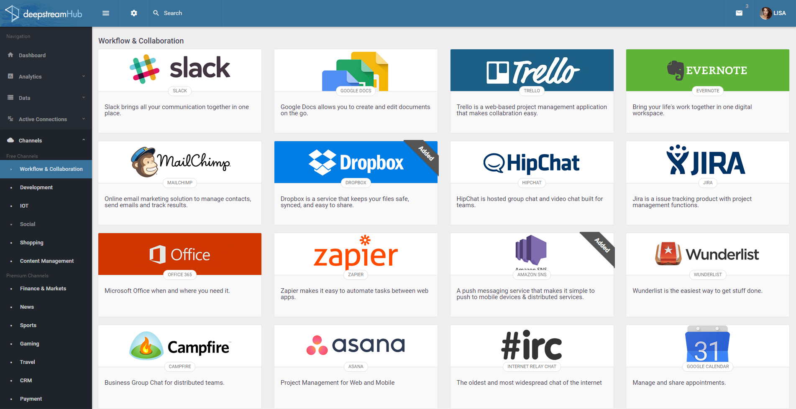
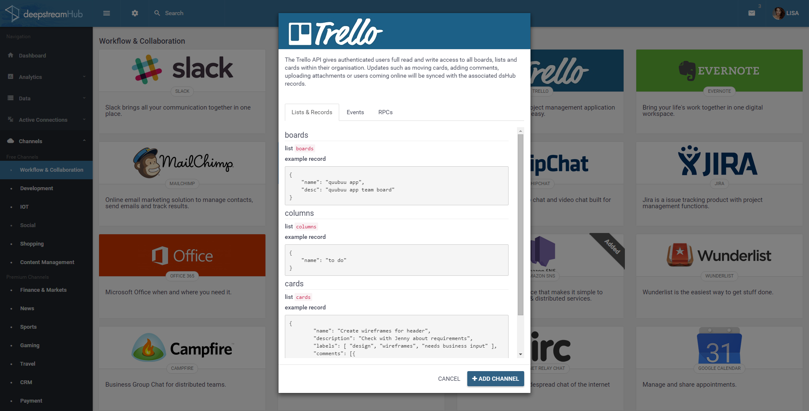
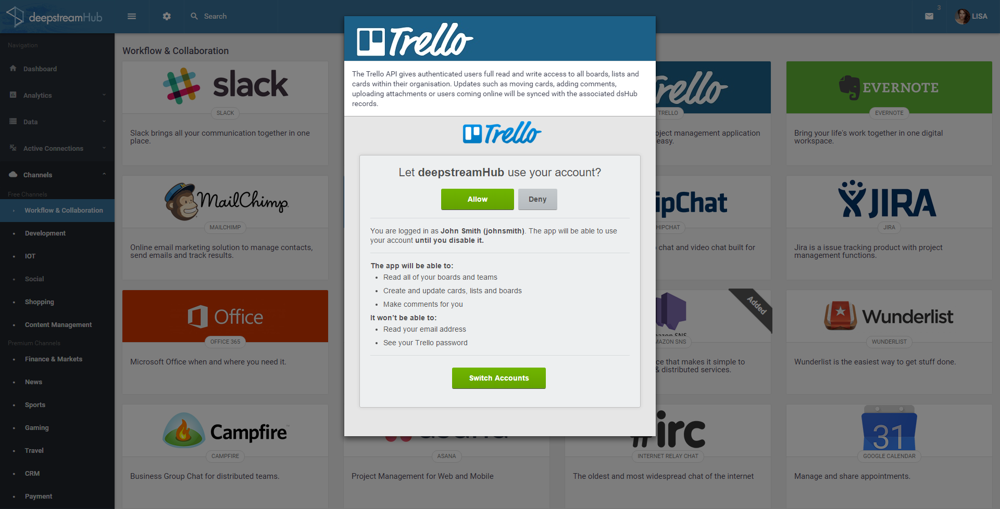

{
	"title": "Introducing deepstreamHub",
	"dateISO": "20151215",
	"author": "wolframhempel",
    "thumbnail": "deepstream-hub-750.png"
}

Ever since we’ve started working on deepstream.io, we’ve been toying with the idea of using it to build something bigger: A platform that makes it easy for developers from all backgrounds to build great realtime apps, using their own data as well as live feeds from a myriad of services.

Today, we’re ready to announce that we’ve started developing just that: deepstreamHub.

deepstreamHub will be a hosted deepstream cluster in the cloud, comparable to Firebase, Pusher or realtime.co, but offering the full deepstream featureset of data-sync, pub-sub, request-response and WebRTC.

Where it gets really interesting though is “deepstreamHub Channels”. Channels let you stream data from third party services directly into your frontend – without any integration code. 

Channels let you integrate with a wide array of services. Collaboratation tools (e.g. Trello, Google Docs), Communication (e.g. Slack) dev-tools (Github), Social Networks, Content Management.

Here’s how it works:

Select a channel:

Add the channel:

Authententicate with third party service:

