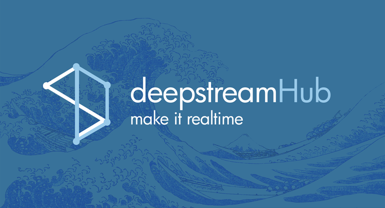

{
	"title": "Introducing deepstreamHub",
	"dateISO": "20151215",
	"author": "wolframhempel",
    "thumbnail": "deepstream-hub-750.png"
}

Ever since we’ve started working on deepstream.io, we’ve been toying with the idea of using it to build something bigger: A platform that makes it easy for developers from all backgrounds to build great real-time apps, using their own data as well as live feeds from a myriad of services.

Today, we’re ready to announce that we’ve started developing just that: **deepstreamHub**.

deepstreamHub will be a hosted deepstream cluster in the cloud, comparable to Firebase, Pusher or realtime.co, but offering the full deepstream feature set of data-sync, pub-sub, request-response and WebRTC.

Where it gets really interesting though are deepstreamHub’s __Channels__. Channels let you stream data from third party services directly into your frontend – without any integration code.

### Here’s how it works:

Channels let you connect to a wide array of services. Collaboration tools (e.g. Trello, Google Docs), communication (e.g. Slack), dev-tools (e.g. Github), social networks, content management systems etc…

We're also planning premium channels for Financial Data, Sports Results, Payment, CRM systems and so on. Whichever channels you add to your app, the process is always the same: 

1) Select one or more channels:

2) Add the channel:

View the channel description to get a clear view on the type of data the channel provides

3) Authenticate:

Authenticate with the third party service to work with deepstreamHub

4) Use it

And that’s it! From here on your channel’s real-time data is available to all connected front or backend services as ds-records, lists or events.

If you’d like to learn more, follow us on [twitter](//twitter.com/deepstreamIO) or subscribe to our newsletter. And of course, give deepstream.io a try…it’s actually quite neat.

