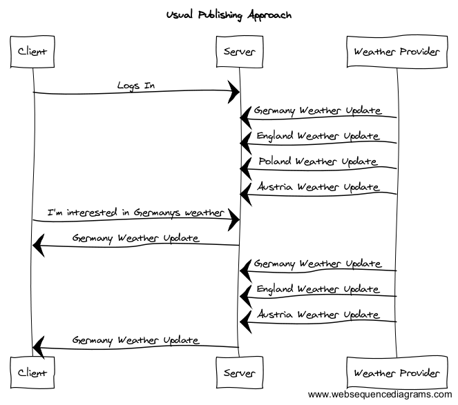
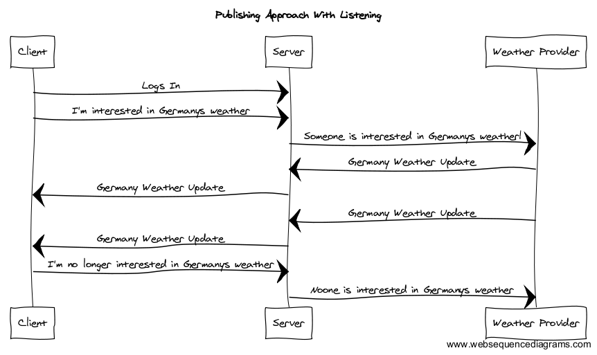

{
    "title": "The benefits of listening",
    "dateISO": "20160216",
    "author": "yasserf",
    "thumbnail": "listening-dog.jpg"
}

Realtime systems have a reputation of being expensive to run. Lets take a look at why and what we can do to make it better. But before we start, let’s take a quick look at how many realtime systems work today.

Realtime uses [push](https://en.wikipedia.org/wiki/Push_technology) technology to tell the world when something happens. This means it sends updates immediately whenever something happens rather than wait to be asked. 

Where this all gets really interesting is behind the client connection, in the land of databases, your server code and integrations with third-party data. Pretty much the rest of the iceberg that makes your application functional but is hidden away behind a beautiful minimalistic interface. Those systems tend to be run in a bit of isolation, meaning they often don't know or care if any clients are actually interested in what they are publishing or if they're literally just creating redundant data noone will ever notice ( other than the people from devops monitoring your resource consumption ).

You can see this in the image below, where worldwide weather updates are constantly being pumped into the system although the subscriber is only interested in germany.



### So where does listening come in?

The ideal goal in any system is to limit the amount of moving data in order to reduce the total amount of required resources and costs. One way of doing so is by saying that at least one client has to actually request something before you start pushing data to it. In more detail, as soon as the first client requests something, publishers can get notified and start publishing data, and when the last client loses interest the publisher no longer needs to pump that data into the system.

This works amazingly well for events, where the actual responsibility is taken off the publisher to submit all events constantly. If you look at this in context of hardware, like IoT sensors, it could result in huge improvements in energy usage, since the device can suspend activity until it knows it's needed. In context of software, it reduces the load on the system significantly since no redundant events would ever be fired. As you can see in the image below, a publisher that is aware of what data is requested has much less activity with the same result.



Finally, this approach shines the most for when the data being sent out is actually driven by the name of your request. For example, requesting 'weather/germany-berlin-1w' means the publisher needs to know that it will be sending out information for a 1 week forecast.

#### How it scales

You don't want more than one publisher updating the same record or emitting the same event. But you want to scale your microservices so they can cope with
huge amounts of data coming into your system, often from the same third party service. You can use the listen functionality to easily split concerns by handling more specific requests across multiple publishers.

For example, you could create two identical providers except where one listens to requests to all countries starting with starting with the first half of the alphabet '^weather/[a-k]' and the other to the second half '^weather/[m-z]'. This can be cut into as many publishers as you see fit to easily scale your processes within the cloud.

#### How to implement

The provider listens to records and events matching the name 'weather/'

```javascript
ds.event.listen( '^weather/.*', onMatch );
```

And the onMatch callback will be notified for all the current matches in the system, new ones that come in and old ones that noone is interested in anymore.

```javascript
function onMatch( subject, provide ) {
    //Subject is the name of the event or record that is being subscribed too

    //If provide is true it means you should start publishing data, if it's false it means you should stop
}
```

If the provider can no longer provide the data, it can stop providing by calling:

```javascript
ds.event.unlisten( '^weather/.*', onMatch );
```

For more details and code, take a look at our [tutorial](../../tutorials/data-provider.html).