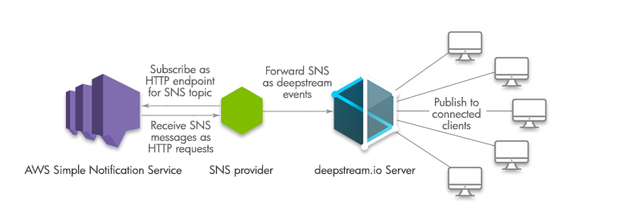
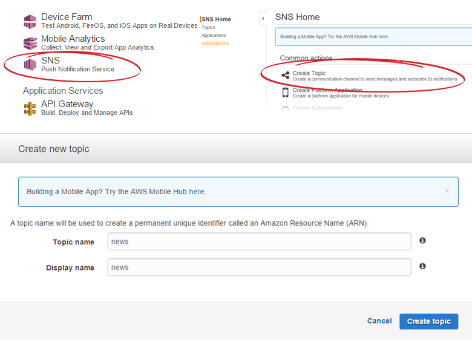
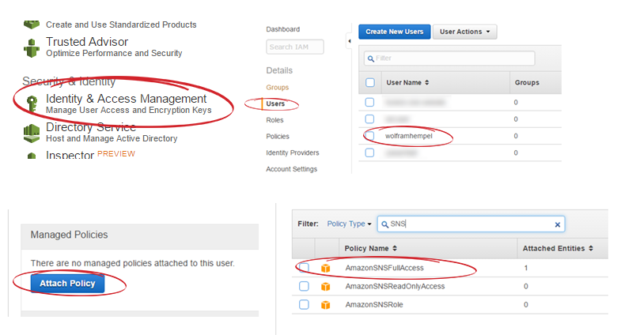

{
	"title": "Publishing AWS SNS messages to browsers",
	"dateISO": "20160104",
	"author": "wolframhempel",
	"thumbnail": "aws-sns-to-browser.png"
}

Sending the same message to Smartphones, Email inboxes and VoIP clients on an Amazon scale? Sounds great! And that’s exactly what AWS’ Simple Notification Service lets you do. It’s a realtime-pub-sub-hub that lets you fan out the same data to AWS services like SQS or Lambda as well as to a wide range of connected devices. 
There’s one thing though it doesn’t do: send your message directly to web browsers. Here’s how to close this gap with a bit of deepstream.io.

### The basic setup
In this tutorial, we’ll build a “sns-provider”, a node process that subscribes to a SNS topic and forwards its messages as deepstream events. For this to work, our provider needs to

- Authenticate against AWS
- Become a SNS HTTP endpoint
- Subscribe to a SNS topic
- Connect to deepstream
- Forward incoming messages as deepstream events

Phew, that sounds like a lot! But, it’s actually not that bad. Here’s what our setup will look like



If you prefer diving right into the code, check out the [github repo](//github.com/deepstreamIO/ds-tutorial-aws-sns)

### A bit of a disclaimer
For brevities sake, this tutorial skimps on security. AWS security is extremely powerful, but also complex enough to have [whole books written about it](//media.amazonwebservices.com/AWS_Security_Best_Practices.pdf). We’ll be using http instead of https, temporary security tokens (which is a good idea), but store them as plain text in our code (which is not) and a deepstream.io server that’s open to the world, instead of [properly permissioned](//deepstream.io/tutorials/authentication.html).
This tutorial also assumes that you're already familiar with deepstream's basic concepts. If not, quickly head over to the [getting started](//deepstream.io/tutorials/getting-started.html) tutorial - don't worry, I'll wait.

### Let’s get started: Creating a topic.
We’ll start by creating a topic via the AWS console. Topics are the fundamental concept for message routing in a pub-sub architecture: Many subscribers listen to a topic and are notified whenever something publishes a message on that topic. Basically, it’s like JavaScript events, but you have to create a topic before you can subscribe.
Let’s create a topic called “news” via the console:



### Create the http server
Next up, we need to start an http server. Why? The way SNS notifies your application of incoming messages is via HTTP.  For this to work, your application needs to:

-   Start a HTTP server
-   Subscribe to a topic and tell SNS which URL it should send updates to
-   Receive a “do you really want to receive updates?” message on that URL
-   Confirm that message

And from there on, it receives all updates as incoming http requests. A few things to note about these requests:

-   All incoming requests are POST requests
-   The message data is JSON encoded
-   Each message contains a " x-amz-sns-message-type” header that tells you which kind of message it is (e.g. “SubscriptionConfirmation” or “Notification”)

With this in mind, here’s what our http server looks like

```javascript
function createHttpServer() {
	var server = new http.Server();
	server.on( 'request', function( request, response ){
		request.setEncoding( 'utf8' );

		//concatenate POST data
		var msgBody = '';
		request.on( 'data', function( data ){ 
			msgBody += data;
		});
		request.on( 'end', function(){
			var msgData = parseJSON( msgBody );
			var msgType = request.headers[ 'x-amz-sns-message-type' ];
			handleIncomingMessage( msgType, msgData );
		});

		// SNS doesn't care about our response as long as it comes
		// with a HTTP statuscode of 200
		response.end( 'OK' );
	});

	server.listen( 6001, subscribeToSnS );
}
```

Oh, and before I forget: Your http server needs to be accessible from the internet. If you're running it locally, you might want to use a tool like [ngrok](//ngrok.com/) to make this possible.

### Subscribing to a topic
Using the [AWS-SDK for NodeJS](//aws.amazon.com/sdk-for-node-js/), subscribing to a topic is as easy as

```javascript
var AWS = require('aws-sdk');
var sns = new AWS.SNS();

sns.subscribe({
	Protocol: 'http',
	//You don't just subscribe to "news", but the whole Amazon Resource Name (ARN)
	TopicArn: 'arn:aws:sns:eu-central-1:792569207202:news',
	Endpoint: '//your-endpoint-url.com'
}, function( error, data ) {
	console.log( error || data );
}); 
```

But for this to work, we need to get two security steps out of the way first: Permission a user to use SNS and add its credentials to the Node SDK.

Here's how to permission a user via the AWS console:



Next, we need to create a security token for this user. Using the [AWS command line tool](//aws.amazon.com/cli/) this is as simple as

```text
aws sts get-session-token
```

This will display a set of credentials that we can use to configure our SDK.

```javascript
var AWS = require('aws-sdk');
AWS.config.update({
	"secretAccessKey": "...",
	"sessionToken": "...",
	"accessKeyId": "...",
	"region": "eu-central-1"
});
var sns = new AWS.SNS();
```

As mentioned before, embedding your credentials into the code might be easy, but it isn't safe. Have a look at the [config documentation](//docs.aws.amazon.com/AWSJavaScriptSDK/guide/node-configuring.html) to find a better way to store credentials.

### Confirming your subscription
Great, now our call to `sns.subscribe` should work. A few milliseconds after we've made it, our http server should receive a message, asking it to confirm the subscription. To process it, it's time to fill in the `handleIncomingMessage( msgType, msgData );` method from the http-server snippet.

```javascript
function handleIncomingMessage( msgType, msgData ) {
	if( msgType === 'SubscriptionConfirmation') {
		//confirm the subscription.
		sns.confirmSubscription({
			Token: msgData.Token,
			TopicArn: msgData.TopicArn
		}, onAwsResponse );
	} else if ( msgType === 'Notification' ) {
		// That's where the actual messages will arrive
	} else {
		console.log( 'Unexpected message type ' + msgType );
	}
}
```

### Starting a deepstream.io server
Now it's time to start our deepstream server. Just create a separate js file (e.g. start-server.js) with

```javascript
var DeepstreamServer = require( 'deepstream.io' ),
	server = new DeepstreamServer();

server.start();
```

and run it


As the console shows, the server is now listening for TCP connections (e.g. from a node client) on port `6021` and for browser connections on port `6020`. If you'd prefer different hosts/ports, please have a look at the [configuration docs](//deepstream.io/docs/deepstream.html).

All that's left now is to connect our SNS-provider to the deepstream server:

```javascript
var deepstreamClient = require( 'deepstream.io-client-js' );
var ds = deepstreamClient( 'localhost:6021' ).login();
```

### Forwarding SNS messages as deepstream events
Ok, time for the last piece of the puzzle. Every time we receive a message from SNS, we want to forward it as a deepstream event. (Events are deepstream's pub-sub mechanism. They work exactly like a JavaScript event emitter, distributed across many clients).

Each SNS message has a "Subject" and a "Message" - both of which are plain text. This leaves us with a couple of choices: We could use the topic as an event name, send JSON as the message body or come up with a totally different mechanism. But for now, let's keep things simple: Every time we receive a message, we'll use the Subject as an event-name and send the message content as event-data... or in code, inside our `handleIncomingMessage` method:

```javascript
else if ( msgType === 'Notification' ) {
	ds.event.emit( msgData.Subject, msgData.Message );
}
```

Subscribing to this event from a browser is now as easy as

```javascript
ds.event.subscribe( 'someEvent', function( data ){
	//...
});
```

And that's it. Thanks for holding out with me for so long. If you'd like to learn more about events in deepstream, head over to the [Events & RPC tutorial](//deepstream.io/tutorials/events-and-rpcs.html)
or have a look at the [event documentation](//deepstream.io/docs/client.event.html)